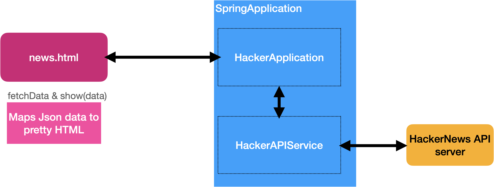

# Hacker

a simple HackerNews project in Spring.

## To Run:

in one Terminal, start the Spring server.

Using vscode, in the HackerApplication.java file, run the `static main` method.
That will bring a spring server on port `8080`.

in a browser, browse to http://localhost:8080/news.html
(NB: the `.html`) (there will be a slight delay as the news articles load.)

## Now

Read the code. Look at the `NewsController` class. Also the `news.html` file.

## Overall Idea

Build a simple spring container (app server) that responds to a web request for the Top Ten New news stories from the
`https://news.ycombinator.com` site's API portal producing a REST response which gets formatted by JS in the `news.html` file.

So it's a spring server that listens for requests, and on each request, the server calls an API service over HTTP, retrieving the latest news stories.

Fortunately, this API does not require the creation of an API key. 
See `https://github.com/HackerNews/API` for more.



## the simple REST stuff in Spring

The very simple POJO, and it's controller. Three URLS, one produces a simple JSON string, the second an HTML response and a third produces JSON.

## a Very Simple Vanilla JaveScript front end.

Using the browser's main `fetch().then().catch()` methods. These make it really easy to fetch from a REST API in a
small piece of javascript. See `resources/static/news.html`

If you put `.html` files (or .js or .css) in `resources/static`, the Spring server will happily serve them up 
without having to have any java code that responds to those urls.
 (So you can put all sorts of useful file things in there).


## HackerNews Api Service

Inside, there is a simple `HackerApiService` that fetches the very latest HN headlines.
This is really the only thing the Spring server does.

Using the URL `https://hacker-news.firebaseio.com/v0/newstories.json?print=pretty`
to doa HTTP GET, you get a JSON object back, an array of articles. (about 500 long)

```
[ 32399397, 32399396, 32399372, 32399368, 32399354, 32399347, ... 32392588, 32392573 ]
```

Then you break this string down into individual strings like `"32399397"` and put them in
an array(list).

Now, taking each article Id, you ask for an HTTP GET on 

`https://hacker-news.firebaseio.com/v0/item/32399397.json?print=pretty` (see where the article Id is?)

You get a JSON response like 

```
{
  "by" : "dhouston",
  "descendants" : 71,
  "id" : 8863,
  "kids" : [ 32399398, 32399399, 89588884 ],
  "score" : 104,
  "time" : 1175714200,
  "title" : "My YC app: Dropbox - Throw away your USB drive",
  "type" : "story",
  "url" : "http://www.getdropbox.com/u/2/screencast.html"
}
```

And then take the first ten items out of the list of articles, and return each json 'nugget' about each news item in a list.
